# Olá, eu sou o Arthur! 👋

### Desenvolvedor Web · Tecnologia · Games

Explorando o desenvolvimento web e transformando curiosidade em projetos. Sempre aprendendo algo novo e construindo minha próxima ideia.

## Sobre mim

- 🎮 Apaixonado por games e tecnologia
- 💻 Desenvolvedor web, criando projetos e explorando novas tecnologias
- 🚀 Gosto de aprender na prática, criando projetos e experimentando novas ferramentas
- 📚 Em constante evolução como desenvolvedor

## Tecnologias e ferramentas

### Desenvolvimento

### Dados, ferramentas e deploy

## Atividade

Confira meus projetos, repositórios e contribuições diretamente no meu [perfil do GitHub](https://github.com/arthurdasilvaleal).

## Também me encontre em

_“A melhor forma de aprender é construir.”_

